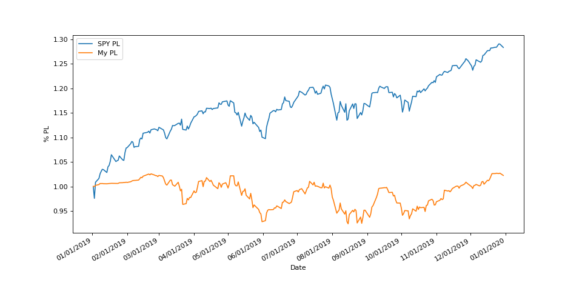
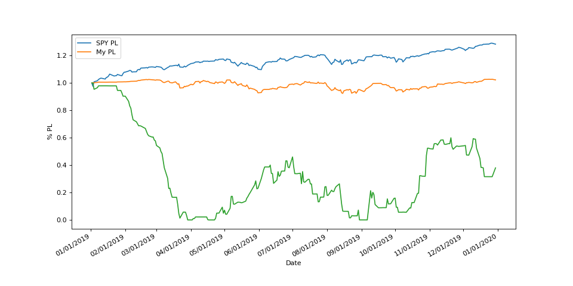

# Insider Trading Backtesting

Hi there,

This is Python-based project that extracts insider trading data from the SEC EDGAR database (datasets can be downloaded from https://www.sec.gov/dera/data/form-345) and enables backtesting on a trading strategy based on insider buying activity. The project uses Pandas and is designed to be efficient by incorporating multithreading to run multiple strategies simultaneously.

Strategies are defined in the params.json file. The configurable details are:

- Fragment size- The percentage of the portfolio to spend on each transaction
- Loss stop- The profit/loss percentage at which the losses on a particular holding are cut and it is sold.
- Profit target- The profit/loss percentage at which the gains on a particular holding are realized and it is sold.
- Expiration- The maximum duration to hold any stock.
- Starting cash- The initial amount of cash in the beginning of the backtest.

You can also specify the start and end date of the backtest, as well as the location of various input and output files.

The backtester takes the parameters and simulates the performance of the portfolio. 

## Usage
1. clone the repo and install the dependencies with 
    ```
    pip install -r requirements.txt
    ```
2. Download the datasets for the backtest duration from https://www.sec.gov/dera/data/form-345. You can use the extract_datasets.py script to automatically unzip the files. Do not rename the files!
3. Specify the start and end date in the params.json file. Also specify where the insider transactions files are located in the transaction_files property. These could be  absolute or relative paths from the root of the project directory. Each path should point to the folder that contains the insider transactions files.
4. The first step that the backtester will do is filter out all the data from the dataset that isn't relevant to the trading algorithm. For the full criteria regarding what filings are filtered out you can check out the filter_EDGAR_data.py script. The backtester will save the filtered data in a file specified in the params.json file as the filtered_transactions_output_file property. If you want to rerun the backtest with other parameters you can change the already_computed property to true and the filtering step will be skipped.
5. The dollar value of the insider transactions range substantially. You can set the minimum dollar value that you are interested in by specifying the minimum_transaction_value property in the params.json.
6. The cached_ticker_data_dir property is the path to the folder where you want the historical prices of the tickers to be cached. The prev_cached_ticker_data_dirs is a list of paths to directories that contain cached historical data that you want to load into the backtest. cached_ticker_data_dir and prev_cached_ticker_data_dirs may be the same value if you are rerunning the same backtest. However, for efficiency there are times where it is better to have fine grained control over what cached data is loaded.
7. Next, you need to specify the strategies that you want to test. The strategies property in the params.json file is a list of key-value mappings that specify the trading strategy. The recognized keys are:
    - fragment_size
    - loss_stop
    - profit_target
    - expiration
    - starting_cash
    - stats_output_file
    - simlation_output_file
    - simlation_output_graph
    - liquidity_graph
    
    The last 4 are paths to where you would like the output to be created. The _graph paths should end with .png, the stats file should end with .json and the simlation_output_file should end with .csv
8. Run
    ```
    python main.py 
    ```
    to execute the backtester!


## Output
Each backtest outputs four files: stats_output_file, simlation_output_file, simlation_output_graph, liquidity_graph.

The stats_output_file tells you how many transactions were sold at the stop loss, sold at the target, and how many were held to expiration. It also records the tickers that fell into those categories.

The simlation_output_file is a table where each row represents a day in the backtest. The columns of this table are: 
- date
- $p/l- Dollar amount of profit/loss in the portfolio
- %p/l- Percentage profit/loss of the portfolio
- SPY $p/l- The $p/l for SPY in the same time period
- SPY %p/l- The %p/l for SPY in the same time period
- percent liquid- The percentage of the portfolio value that is cash
- cash balance- The dollar amount of cash in the portfolio

Example output:
```
,date,$p/l,%p/l,SPY $p/l,SPY %p/l,percent liquid,cash balance
0,2019-01-02 00:00:00,0.0,1.0,0.0,1.0,1.0,5000.0
1,2019-01-03 00:00:00,0.0,1.0,-6.079999999999984,0.9757023538344723,1.0,5000.0
2,2019-01-04 00:00:00,11.019799999999123,1.00220396,2.1599999999999966,1.0086320585061743,0.953580307146262,4778.409799999999
3,2019-01-07 00:00:00,19.34979999999905,1.0038699599999998,4.060000000000002,1.0162250729329017,0.9656329989195015,4846.849799999999
4,2019-01-08 00:00:00,30.075399999998808,1.0060150799999998,6.390000000000015,1.025536506414099,0.9790122430371522,4924.505399999999
5,2019-01-09 00:00:00,29.575399999998808,1.0059150799999999,7.690000000000026,1.0307317268113336,0.9791095685731246,4924.505399999999
``` 


The simlation_output_graph is a plot of the portfolio's performance over the course of the backtest. This plot is overlaid with the performance of SPY in the same time period. The goal here is to outperform the market. An example output:


The liquidity_graph is similar to the simlation_output_graph except the percentage of the portfolio that is cash is also plotted. An example liquidity graph:



## Next Steps
- Some insiders buy their own stock on a regular basis, these purchases do not indicate that the insider thinks the stock will go up. Implementing a system where the algorithm looks at this insiders purchase history may improve performance. 
- Once the insider transactions are filtered there are only ~1500 transactions per year. The historical prices of all the relevant tickers could easily be downloaded and strategies could be tested en masse to find the optimal set of parameters. A distributed data processing framework like Apache Spark could be used to test millions of combinations over many years of data relatively quickly.


## Final Thoughts
I was inspired to build this tool by a TikTok I saw about a person claiming to make a consistent income by trading stocks based on the form 4 filings that the SEC makes publically available. I was unable to reproduce those results in my backtests :( 
    


